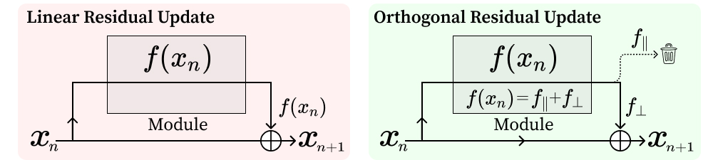
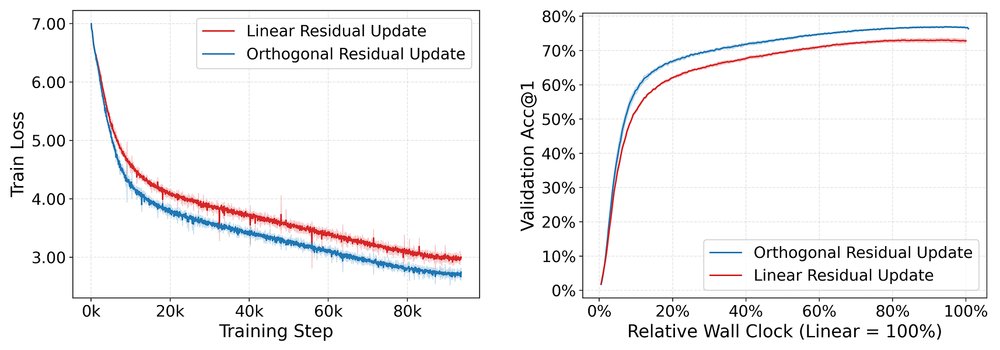

# Revisiting Residual Connections: Orthogonal Updates for Stable and Efficient Deep Networks

📢 Accepted at NeurIPS 2025 (Poster)

This repository provides the official PyTorch implementation for the paper:
[Revisiting Residual Connections: Orthogonal Updates for Stable and Efficient Deep Networks
](https://arxiv.org/abs/2505.11881)

🚀 Try our pretrained on ImageNet-1k **OrthoViT-B** model directly via [Hugging Face](https://huggingface.co/BootsofLagrangian/ortho-vit-b-imagenet1k-hf).

## Abstract

Residual connections are pivotal for deep neural networks, enabling greater depth by mitigating vanishing gradients. However, in standard residual updates, the module's output is directly added to the input stream. This can lead to updates that predominantly reinforce or modulate the existing stream direction, potentially underutilizing the module's capacity for learning entirely novel features. In this work, we introduce _Orthogonal Residual Update_: we decompose the module's output relative to the input stream and add only the component orthogonal to this stream. This design aims to guide modules to contribute primarily new representational directions, fostering richer feature learning while promoting more efficient training. We demonstrate that our orthogonal update strategy improves generalization accuracy and training stability across diverse architectures (ResNetV2, Vision Transformers) and datasets (CIFARs, TinyImageNet, ImageNet-1k), achieving, for instance, a +4.3\%p top-1 accuracy gain for ViT-B on ImageNet-1k.

## Method Overview

Our core idea is to modify the standard residual update $x_{n+1} = x_n + f(\sigma(x_n))$ by projecting out the component of $f(\sigma(x_n))$ that is parallel to $x_n$. The update then becomes $x_{n+1} = x_n + f_{\perp}(x_n)$, where $f_{\perp}(x_n)$ is the component of $f(\sigma(x_n))$ orthogonal to $x_n$.


*Figure 1: (Left) Standard residual update. (Right) Our Orthogonal Residual Update, which discards the parallel component $f_{||}$ and adds only the orthogonal component $f_{\perp}$.*

This approach aims to ensure that each module primarily contributes new information to the residual stream, enhancing representational diversity and mitigating potential interference from updates that merely rescale or oppose the existing stream.

## Key Results: Stable and Efficient Learning

Our Orthogonal Residual Update strategy leads to more stable training dynamics and improved learning efficiency. For example, models trained with our method often exhibit faster convergence to better generalization performance, as illustrated by comparative training curves.


*Figure 2: Example comparison (e.g., ViT-B on ImageNet-1k) showing Orthogonal Residual Update (blue) achieving lower training loss and higher validation accuracy in less wall-clock time compared to linear residual updates (red).*

## Requirements
- Python 3.8+
- PyTorch 
- torchvision

Install dependencies:
```bash
pip install -r requirements.txt
```

## Training

We use torchrun for distributed training.General

```bash
torchrun --nproc-per-node [N_GPU] train_classifier.py --config_file [path_to_config_file] [additional_options]
```

### Arguments
- N_GPU: Number of GPUs to use for training
- train_classifier.py: Main training script
- --config_file [path_to_config_file]: Path to the YAML or Python configuration file specifying model, dataset, and training parameters
- Activating Orthogonal Residual Updates: To enable our Orthogonal Residual Update mechanism, add the following flag to the training command `--orthogonal_residual`.
Without this flag, the models will use standard linear residual updates by default. 

- You can also specify the type of orthogonalization (e.g., feature or global) via `--orthogonal_method feature`, `--orthogonal_method global`. `feature` (feature-wise, also known as Orthogonal-F in the paper) is the default.

- Predefined Recipes / Config Files:We provide several predefined configuration files (recipes) in the configs/ directory for reproducing the key results reported in our paper.

For example, to train ViT-S with Orthogonal Residual Updates on Tiny ImageNet
`torchrun --nproc-per-node [N_GPU] train_classifier.py --config_file recipes/vit_s_tiny.yaml --orthogonal_residual
`

## Results
Our method demonstrates consistent improvements across various models and datasets. For detailed results, please refer to our paper, particularly Table 2 (main results) and ablation studies in Section 4.

## Citation
If you find this work useful for your research, please consider citing our paper:

```
@article{oh2025revisiting,
      title={Revisiting Residual Connections: Orthogonal Updates for Stable and Efficient Deep Networks}, 
      author={Giyeong Oh and Woohyun Cho and Siyeol Kim and Suhwan Choi and Youngjae Yu},
      year={2025},
      journal={arXiv preprint arXiv:2505.11881},
      eprint={2505.11881},
      archivePrefix={arXiv},
      primaryClass={cs.CV},
      url={https://arxiv.org/abs/2505.11881}
}
```
